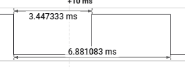

# E-01：风扇 TACH 逻辑分析仪测速

## 目的与口径

用逻辑分析仪直接测量风扇 TACH 相邻下降沿周期，建立供电电压、TACH 频率、机械转频和转速之间的对应关系，为振动频谱中的机械 1×/2× 判定提供独立依据。

本风扇已确认为常见的 **2 脉冲/转（PPR=2）**。因此：

```text
f_tach = 1 / T_tach
f_1x = f_tach / 2
RPM = f_1x × 60 = f_tach × 30
七叶片叶片通过频率 BPF = 7 × f_1x
```

## 环境与测量方法

- 日期：2026-09-28。
- 对象：七叶片风扇，TACH 输出为 2 PPR。
- 仪器：逻辑分析仪。
- 测量量：相邻下降沿到相邻下降沿的完整周期。
- 波形特征：6 V、12 V 工况占空比均约 50%；截图工况高电平宽度 3.447333 ms、完整周期 6.881083 ms，占空比 50.10%。
- 固件参与：无；本实验是独立于 STM32/MPU6050 采样链路的外部测速。

## 原始证据



截图只证明该次稳定区间的周期和占空比；当次供电电压尚未明确标注，因此不把它擅自归入 6 V、9 V 或 12 V。

## 实测与换算结果

| 工况 | 平均 TACH 周期 | TACH 频率 | 机械 1×（PPR=2） | 转速 | 七叶片 BPF |
|---|---:|---:|---:|---:|---:|
| 6 V | 9.8 ms | 102.04 Hz | 51.02 Hz | 3061 RPM | 357.14 Hz |
| 电压未标注的截图 | 6.881083 ms | 145.326 Hz | 72.663 Hz | 4360 RPM | 508.64 Hz |
| 12 V | 5.45 ms | 183.49 Hz | 91.74 Hz | 5505 RPM | 642.20 Hz |

表中 6 V、12 V 周期是用户报告的稳定区间平均值；当前未保留周期数、总测量时长和最小/最大周期，因此不能据此计算转速波动或测量不确定度。

## 结论

1. TACH 脉冲频率随供电电压从 6 V 到 12 V 明显升高，外部测速链路工作正常。
2. 在已确认 PPR=2 的前提下，6 V 和 12 V 的机械 1× 分别为约 51.02 Hz 和 91.74 Hz；不能把 TACH 脉冲频率 102.04 Hz、183.49 Hz 直接当作机械基频。
3. 截图工况的机械 1× 为 72.663 Hz。若后续确认该截图对应既有频谱工况，则 73.2 Hz 附近峰应优先解释为机械 1×，而 36.6 Hz 附近是约 0.5× 成分；在电压标签完成前，这一对应关系保持为条件结论。
4. 七片叶片只决定叶片通过频率为 `7×机械转频`，不改变 TACH 的 PPR。
5. 项目采样率为 1 kHz，奈奎斯特频率为 500 Hz。截图工况和 12 V 工况的真实 BPF 已超过 500 Hz，可能被前端滤波衰减或混叠，不能直接用 0～500 Hz 内某个峰反推叶频。

## 限制与后续动作

1. 补测并明确记录 9 V 的平均周期、周期数、总时间、最小值和最大值。
2. 重新采集 6 V、9 V、12 V 的同步振动数据，确保每份 FFT 数据都能关联同工况 TACH 记录。
3. 用 51.02 Hz、9 V 实测值和 91.74 Hz 作为各电压机械 1× 候选，检查谱线是否随转速连续移动。
4. 在新数据完成前，不用旧的 36.6 Hz 假设给正式数据填写实测 RPM，也不把叶片通过频率的混叠峰当作机械 1×。
